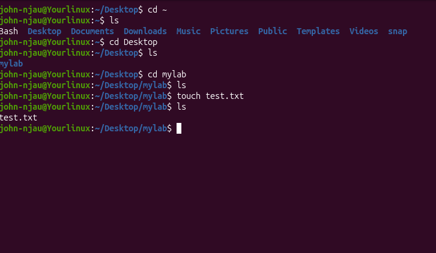

  GNU nano 8.4                                                           README.md *                                                                  
# Linux Fundamentals

## Commands

### ls
Lists files and directories.

Example:
ls
ls -la
ls -l

### cd (change directory)
Changes directory.

Example:
cd /home
cd ..

### pwd (print working directory)
Shows current directory.

### mkdir (make directory)
Used to create a directory

### cat (concatenate)
 Used to view items inside a file

### nano
Used to add or edit content in a file

### mv ~/source/*.file destination/
Used to move files from one directory to another

^G Help         ^O Write Out    ^F Where Is     ^K Cut          ^T Execute      ^C Location     M-U Undo        M-A Set Mark    M-] To Bracket
^X Exit         ^R Read File    ^\ Replace      ^U Paste        ^J Justify      ^/ Go To Line   M-E Redo        M-6 Copy        ^B Where Was
